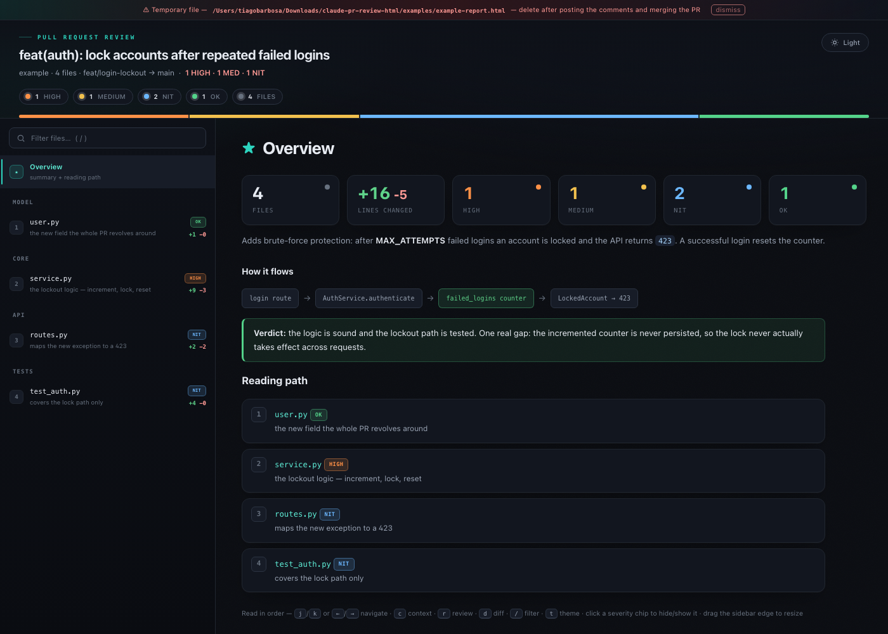
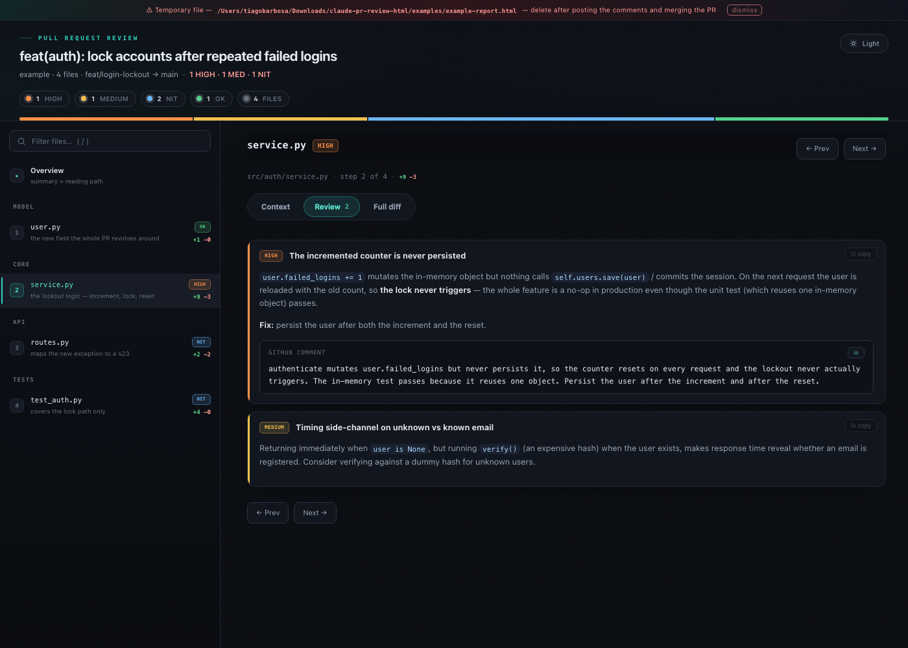
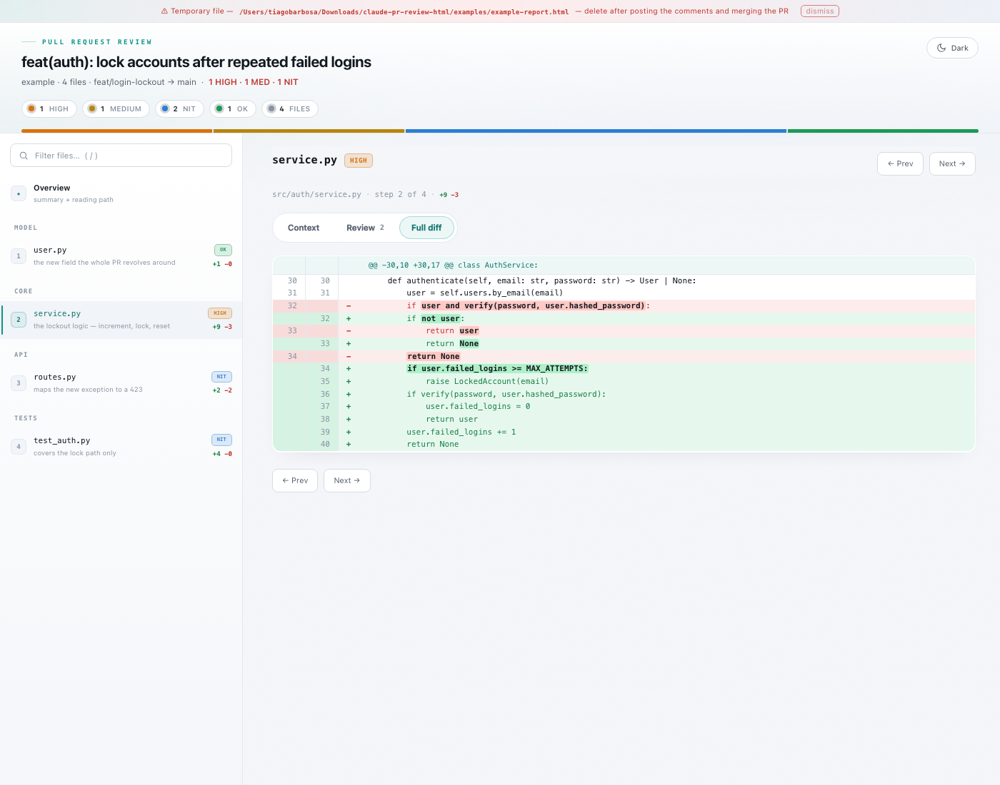

# pr-review-html

A [Claude Code](https://claude.com/claude-code) skill that reviews a pull request
**deeply** and turns the result into a single, self-contained **interactive HTML
report** — a CodeRabbit-style walkthrough you read instead of squinting at
GitHub's review tab.

The review is the point: it reads the *full files* (not just the diff), runs the
change through a set of focused lenses (bugs, cross-file seams, tests, silent
failures, type design, conventions…), and scores every finding by confidence so
only the ones worth your time show up. The report just makes that easy to read.



---

## Why

GitHub's review UI scatters a PR across tabs and shows you an alphabetical file
list with no story. This skill instead gives you **one HTML file** that:

- orders files in **reading order** — source of truth → consumers → tests — so the
  PR explains itself as you walk 1 → N;
- gives every file a plain-language **Context** tab *before* any code, so you
  understand the change before reading the diff;
- puts **severity-rated findings** and the **full diff** (with word-level
  highlighting) one click away;
- is **self-contained and offline** — one `.html`, no server, no CDN, no tracking.
  Open it, read it, delete it.

## Features

- **Deep, multi-lens review** with a 0–100 confidence score per finding; only
  high-confidence issues surface (fewer false positives than a one-shot pass).
- **Reading-order walkthrough** with a numbered sidebar, Prev/Next, and a clickable
  reading path on the overview.
- **Three tabs per file:** Context (plain-language), Review (severity-rated
  comments), Full diff (two-gutter, GitHub-style colours, `<mark>` word highlights).
- **Overview dashboard:** stat grid, before→after flow, one-line verdict.
- **Light & dark themes**, toggled in the header (remembered across visits).
- **Keyboard-driven:** `j`/`k` or `←`/`→` navigate, `c`/`r`/`d` switch tabs, `/`
  filter, `t` theme.
- **Copy-ready comments:** each finding can carry a GitHub-ready draft and copies
  with its file reference attached.
- **Zero dependencies:** pure-Python generator, system fonts, one output file.

|                     Review tab                     |               Full diff (light theme)               |
| :------------------------------------------------: | :-------------------------------------------------: |
|               |              |

## Install

The skill lives in `~/.claude/skills/pr-review-html/`.

**From the release zip:**
```bash
unzip pr-review-html.zip
mkdir -p ~/.claude/skills
cp -R pr-review-html ~/.claude/skills/
```

**Or from this repo:**
```bash
git clone https://github.com/th0rz05/claude-pr-review-html.git
mkdir -p ~/.claude/skills
cp -R claude-pr-review-html/pr-review-html ~/.claude/skills/
```

Then open a fresh Claude Code session — `/pr-review-html` should appear in the
skills list.

### Requirements

- [Claude Code](https://claude.com/claude-code)
- `python3` on your PATH (the generator has no external dependencies)
- `gh` CLI, authenticated (`gh auth login`) — used to fetch the PR diff

## Usage

In Claude Code:

```
/pr-review-html 123
/pr-review-html https://github.com/owner/repo/pull/123
```

Claude fetches the PR, reviews it against your repo's standards (it reads your
`CLAUDE.md` and any convention docs), writes a review, generates the HTML, and
opens it. Ask it to post the findings as inline PR comments if you want.

## How it works

```
gh pr diff ──▶ read full files ──▶ multi-lens review ──▶ score & filter ──▶ review.json
                                                                               │
                                                        generate_review_html.py ▼
                                                                          report.html
```

The skill's methodology lives in [`pr-review-html/SKILL.md`](pr-review-html/SKILL.md);
the generator and its JSON schema are documented at the top of
[`pr-review-html/generate_review_html.py`](pr-review-html/generate_review_html.py).
You can also run the generator directly:

```bash
python3 pr-review-html/generate_review_html.py \
  --diff pr.diff --review review.json --out report.html
```

## Example

Open [`examples/example-report.html`](examples/example-report.html) in a browser to
see a full report for a sample PR.

## Notes

- The generated HTML is a **temporary scratch artifact** — a banner reminds you to
  delete it after the review is done.
- The report is for *reading* a review comfortably; posting to GitHub is a separate,
  optional step.

## License

[MIT](LICENSE) © Tiago Barbosa ([@th0rz05](https://github.com/th0rz05))

> Built as a Claude Code skill. Not affiliated with GitHub or CodeRabbit.
